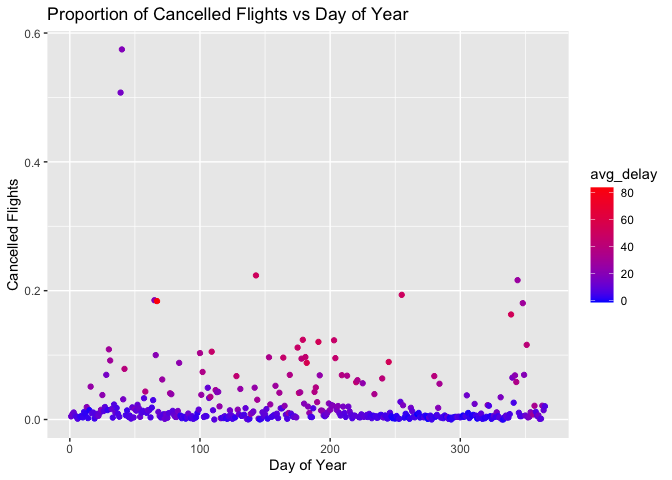

Homework2\_433
================
Makayla Hayes
2/11/2021

How many flights have a missing dep\_time? What other variables are missing? What might these rows represent?

``` r
per<-flights %>% 
  filter(is.na(dep_time))
head(per)
```

    ## # A tibble: 6 x 19
    ##    year month   day dep_time sched_dep_time dep_delay arr_time sched_arr_time
    ##   <int> <int> <int>    <int>          <int>     <dbl>    <int>          <int>
    ## 1  2013     1     1       NA           1630        NA       NA           1815
    ## 2  2013     1     1       NA           1935        NA       NA           2240
    ## 3  2013     1     1       NA           1500        NA       NA           1825
    ## 4  2013     1     1       NA            600        NA       NA            901
    ## 5  2013     1     2       NA           1540        NA       NA           1747
    ## 6  2013     1     2       NA           1620        NA       NA           1746
    ## # … with 11 more variables: arr_delay <dbl>, carrier <chr>, flight <int>,
    ## #   tailnum <chr>, origin <chr>, dest <chr>, air_time <dbl>, distance <dbl>,
    ## #   hour <dbl>, minute <dbl>, time_hour <dttm>

``` r
nrow(per)
```

    ## [1] 8255

Other variables that were missing are dep\_delay, arr\_time, arr\_delay, air\_time.I think these rows represent the flights that were scheduled and then canceled for some reason and never actually took off.

Currently dep\_time and sched\_dep\_time are convenient to look at, but hard to compute with because they’re not really continuous numbers. Convert them to a more convenient representation of number of minutes since midnight.

``` r
flights %>%
  mutate(dep_time,
         dep_time=((dep_time%/%100)*60)+(dep_time%%100))%>%
  mutate(sched_dep_time,
         sched_dep_time=(floor(sched_dep_time/100)*60)+(sched_dep_time%%100))
```

    ## # A tibble: 336,776 x 19
    ##     year month   day dep_time sched_dep_time dep_delay arr_time sched_arr_time
    ##    <int> <int> <int>    <dbl>          <dbl>     <dbl>    <int>          <int>
    ##  1  2013     1     1      317            315         2      830            819
    ##  2  2013     1     1      333            329         4      850            830
    ##  3  2013     1     1      342            340         2      923            850
    ##  4  2013     1     1      344            345        -1     1004           1022
    ##  5  2013     1     1      354            360        -6      812            837
    ##  6  2013     1     1      354            358        -4      740            728
    ##  7  2013     1     1      355            360        -5      913            854
    ##  8  2013     1     1      357            360        -3      709            723
    ##  9  2013     1     1      357            360        -3      838            846
    ## 10  2013     1     1      358            360        -2      753            745
    ## # … with 336,766 more rows, and 11 more variables: arr_delay <dbl>,
    ## #   carrier <chr>, flight <int>, tailnum <chr>, origin <chr>, dest <chr>,
    ## #   air_time <dbl>, distance <dbl>, hour <dbl>, minute <dbl>, time_hour <dttm>

Look at the number of cancelled flights per day. Is there a pattern? Is the proportion of cancelled flights related to the average delay? Use multiple dyplr operations, all on one line, concluding with \`ggplot(aes(x= ,y=)) + geom\_point()’

``` r
flights%>%
  mutate(day_of_year = yday(time_hour))%>%
  group_by(day_of_year)%>%
  summarise(cancelled=sum(is.na(dep_time)))%>%
  ggplot(aes(x=day_of_year,y=cancelled))+geom_point() + labs(title = "Numvber of Cancelled Flights vs Day of Year", x="Day of Year",y="Cancelled Flights")
```


``` r
 flights %>%
 mutate(day_of_year = yday(time_hour)) %>% 
 group_by(day_of_year) %>% 
summarise(cancelled=sum(is.na(dep_time)),
          avg_delay=mean(dep_delay,na.rm = T),
          total=(sum(!is.na(dep_time))+cancelled),
          cancel_prop=(cancelled/total))%>%
ggplot(aes(x=day_of_year,y=cancel_prop,color=avg_delay))+geom_point()+scale_colour_gradient(low="blue",high = "red")+labs(title = "Proportion of Cancelled Flights vs Day of Year", x="Day of Year",y="Cancelled Flights")
```

 This graph shows the Proportion of cancelled flights per day and then the color shows the average departure delay time for that day. There is no clear realationship between cancelled flights and average departure delay.

``` r
 flights %>%
 mutate(day_of_year = yday(time_hour)) %>% 
 group_by(day_of_year) %>% 
summarise(cancelled=sum(is.na(dep_time)),
          avg_delay=mean(dep_delay,na.rm = T),
          total=(sum(!is.na(dep_time))+cancelled),
          cancel_prop=(cancelled/total))%>%
ggplot(aes(x=avg_delay,y=cancel_prop))+geom_point()+labs(title = "Proportion of Cancelled Flights vs AverageDelay", x="Average Departure Delay",y="Cancelled Flights")
```

 This graph plots the proportion of cancelled flights with the average departure delay. Both are per day of the year measurmenst. There seems to be some of a trend where the greater delay the more flights cancelled. Saying that there is also a lot of outliers and no finite trend.

<https://github.com/makaylahayes/Homework2_433>
